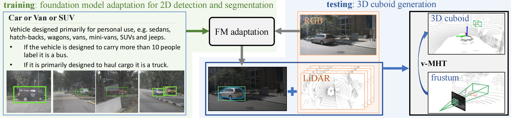

# 🚗📡 Auto-Annotation with Expert-Crafted Guidelines: A Study through 3D LiDAR Detection Benchmark

 <!-- Replace with your actual image path -->

---

## 🧠 Overview

### 🔍 Research Background & Motivation

| Aspect | Description |
|--------|-------------|
| **Current Annotation Paradigm** | Relying on hiring **ordinary human annotators** to label data based on **expert-crafted guidelines**. |
| **Inherent Problems** | Labor-intensive, tedious, and **costly**. |
| **Our Research Goal** | To explore **auto-annotation** methods that directly leverage **expert-crafted guidelines**. |

> 💡 We aim to reduce manual effort while preserving annotation quality by enabling machines to understand and apply expert knowledge.

---

### 🏆 The AutoExpert Benchmark

| Feature | Details |
|--------|---------|
| **Data Source** | Repurposed from the well-established [nuScenes dataset](https://www.nuscenes.org), widely used in autonomous driving. |
| **Guidelines** | Authentic, real-world **expert-crafted** annotation rules. |
| **Object Classes** | Defines **18 object classes** using **nuanced textual descriptions** + a few **visual examples**. |
| **Annotation Task** | Annotate 3D objects using **3D cuboids** from LiDAR data. |
| **Core Challenge** | Guidelines contain **no LiDAR visuals**, requiring models to learn from **few-shot labeled images & texts** for 3D detection. |

---

### ⚠️ Technical Challenges

- **🔄 Data-Modality Discrepancy**: Bridging the gap between **2D image/text data** and **3D point clouds**.
- **🎯 Annotation-Task Discrepancy**: Adapting **2D detection knowledge** to complex **3D detection tasks**.

---

### ✅ Proposed Approach

We propose a **simple yet effective pipeline** leveraging **publicly available Foundation Models (FMs)**:

1. **🔍 2D Object Detection** Use FMs (e.g., GroundingDINO) for **2D detection** on RGB images with refined text prompts.
2. **🤖 VLM-Guided Geometric Reasoning** For highly confident 2D detections, utilize a Vision Language Model (VLM) to infer **instance-specific 3D dimensions** and **initial orientation** via Chain-of-Thought (CoT).
3. **🎭 2D Segmentation & 3D Lifting** Extract precise object masks using SAM and project LiDAR points into the camera frustum.
4. **📦 VLM-Guided 3D Cuboid Generation (v-MHT)** Perform constrained **Multiple Hypotheses Testing (v-MHT)** around the VLM's initial priors to precisely fit the LiDAR points and generate the final 3D cuboid.

---

### 📈 Key Results

| Metric | Our Method (auto3D / v-MHT) | Prior SOTA (CM3D) |
|--------|-----------------------------|-------------------|
| **3D Detection mAP** | **25.4** 🚀 | **12.1** |
| **NDS** | **27.2** 🌟 | **16.6** |
  
> 🎉 Demonstrates the **great potential** of integrating 2D foundational perception with **VLM-guided 3D geometric reasoning** in automating data annotation!

---

## 🛠️ Installation

Follow the steps below to set up the environment (Tested on 4× NVIDIA A100 GPUs):

1. **📥 Clone the Repository**
    ```bash
    git clone https://github.com/annoguide/annoguide3Dbenchmark.git
    cd annoguide3Dbenchmark
    ```
2. **🌱 Create the Conda Environment**
    ```bash
    conda create -n annoguide python=3.10.19
    conda activate annoguide
    ```
3. **⚙️ Install PyTorch & vLLM (For VLM Inference)**
    ```bash
    pip install torch==2.9.0 torchvision --index-url [https://download.pytorch.org/whl/cu118](https://download.pytorch.org/whl/cu118)
    pip install vllm==0.13.0 openai
    ```
4. **⚙️ Install MMDetection & SAM**
    ```bash
    pip install -U openmim
    mim install mmengine
    mim install "mmcv>=2.0.0"
    cd mmdetection
    pip install -v -e .
    cd ..
    pip install segment_anything numba
    ```
*(Note: `numba` is required for accelerating the v-MHT GPU parallel search).*
    ```

## 📂 Data Preparation

| Dataset | Download Link |
|--------|----------------|
| **NuScenes Dataset** | [🔗 NuScenes Official](https://www.nuscenes.org/nuscenes) |
| **Few-shot Data from Guidelines** | [🔗 Google Drive] |
| **Small Validation Set (for Prompt/Model Selection)** | [🔗 Google Drive] |

---

## 🤖 Models

| Model | Source / Download |
|-------|-------------------|
| **GroundingDINO** | [📘 MMDetection Repo](https://github.com/open-mmlab/mmdetection) <br> [🔗 Finetuned Model (Google Drive)] |
| **Segment Anything Model (SAM)** | [🔗 Official Repo](https://github.com/facebookresearch/segment-anything) |
| **Vision Language Model (VLM)** | Hosted via `vLLM` (e.g., Qwen3-VL) or OpenAI API (GPT-4o) |

---

## 🔄 Pipeline Execution

### 🖼️ 2D Detection
1. **​Generate COCO-format 2D Labels to Prepare Data Used in AutoExpert**

     ```bash
    python mmdetection/tools/GD/make_2D_labels.py --info_path data/nuscenes/nuscenes_infos_train.pkl --output_dir_path data/nuscenes/samples/labels_2D_COCO/CAM_ALL_train
    python mmdetection/tools/GD/make_2D_labels.py --info_path data/nuscenes/nuscenes_infos_val.pkl --output_dir_path data/nuscenes/samples/labels_2D_COCO/CAM_ALL_val
    ```
2. **Create AutoExpert Training Set** 

     ```bash
    python mmdetection/tools/GD/make_2D_annos_train_few_shot.py
    python mmdetection/tools/GD/make_few-shot_file_name.py
    ```
3. **Create AutoExpert Validation Set** 

     ```bash
    python mmdetection/tools/GD/make_2D_annos_val.py
    ```
4. **Finetune GroundingDINO with Optimized Prompts**

     ```bash
    python mmdetection/tools/train.py mmdetection/configs/mm_grounding_dino/grounding_dino_swin-l_finetune_8xb4_20e_nuscenes_train.py
    ```
5. **Save 2D Detections by the Finetuned GroundingDINO (with Evaluation)**

     ```bash
    python mmdetection/tools/test.py mmdetection/configs/mm_grounding_dino/grounding_dino_swin-l_finetune_8xb4_20e_nuscenes_test.py weights/GD.pth
    ```
6. **Evaluate the Saved 2D Detections**

     ```bash
    python mmdetection/mmdet/evaluation/metrics/coco_metric.py
    ```

### 🧊 3D Cuboids Generation
1. **Generate 2D Masks with SAM** 
    ```bash
    python mmdetection/tools/GD/add_file_name_in_2D_results.py 
    python src/gen_masks.py
    ```
2. **VLM Inference for Geometric Priors (Size & Orientation)**
     ```bash
    python src/vlm_geometric_reasoning.py
    ```

3. **Generate 3D Cuboids via v-MHT** 
    ```bash
    python src/masks_to_3D_results.py
    ```
4. **Confidence Smoothing via 3D Tracking** 
    ```bash
    python src/post_process/json2pkl.py
    python src/post_process/average_score_by_tracking.py
    ```
5. **3D Evaluation** 
    ```bash
    python src/eval/eval_3D_results.py
    ```
## 📦 Saved Results for Fast Evaluation

| Type | Download Link |
|------|---------------|
| **2D Detection Results** | [🔗 Google Drive]|
| **3D Detection Results** | [🔗 Google Drive]|

---

✅ **Happy Auto-Annotation with Expert Knowledge！**
